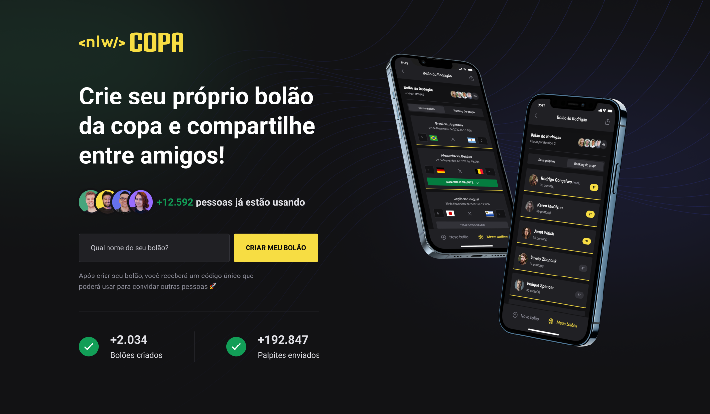
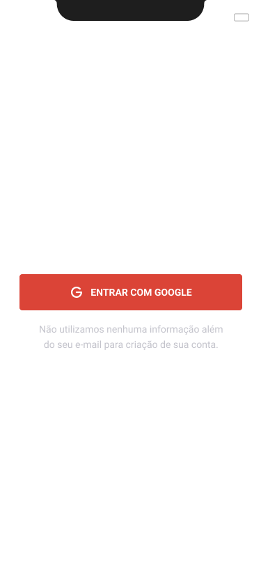
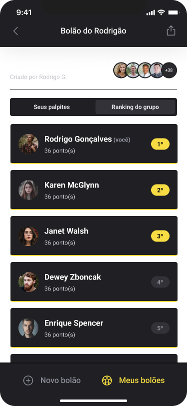

#  Trilha Ignite | Rocketseat

### Projeto criado durante o evento <strong>NLW COPA</strong> onde foi desenvolvido uma plataforma web e mobile com backend onde podemos criar bolões e fazer os nossos palpites.


<hr>

<p align="center">
  <a href="#-tecnologias-utilizadas">Tecnologias</a> -
  <a href="#-resultado-aplicação-web">Resultado WEB</a> -
  <a href="#-resultado-aplicação-mobile">Resultado MOBILE</a> -
  <a href="#-como-executar">Como executar</a>
  <!-- <a href="#-contato">Contato</a>
</p> -->

<a id="-tecnologias-utilizadas"></a>

## Tecnologias utilizadas

<p align="center">
  <a href= "https://html5.org/"></a>
  <a href= "https://developer.mozilla.org/pt-BR/docs/Web/CSS"></a>
  <a href= "https://tailwindcss.com/"></a>
  <a href= "https://postcss.org/"></a>
  <a href= "https://www.javascript.com/"></a>
  <a href= "https://www.typescriptlang.org/"></a>
  <a href= "https://babeljs.io/"></a>
  <a href= "https://nodejs.org/en/"></a>
  <a href= "https://reactjs.org/"></a>
  <a href= "https://reactnative.dev/"></a>
  <a href= "https://expo.dev/"></a>
  <a href= "https://nextjs.org/"></a>
  <a href= "https://www.fastify.io/"></a>
  <a href= "https://axios-http.com/"></a>
  <a href= "https://www.prisma.io/"></a>
  <a href= "https://www.sqlite.org/index.html"></a>
  <a href= "https://www.figma.com/file/IBaKjqTi23ai3kkJ5XdMcN/Bol%C3%A3o-da-Copa-(Community)-(Copy)"></a>
  <a href= "https://code.visualstudio.com/download"></a>
  <a href= "https://github.com/prettier/prettier"></a>
</p>

<p align="center">
  <a href= "https://www.linkedin.com/in/rodrigo-ap-oliveira-61a547b3/"></a>
    <a href= "[@rodrigooliveira0301](https://instagram.com/rodrigooliveira0301)"></a>
  
  
</p>

<a id="-resultado-aplicação-web"></a>

## :computer: Resultado Aplicação WEB



<a id="-resultado-aplicação-mobile"></a>

## :iphone: Resultado Aplicação Mobile

<p align="center">






<a id="-como-executar"></a>

## :white_check_mark: Como executar

Para executar as aplicações seguir os procedimentos abaixo:

-   SERVER;
-   WEB;
-   MOBILE.

-- Procedimento Iniciar backend --

-   Acessar primeiro o diretório server com o comando

```bash
cd server
```

-   Instalar as dependências do backend

```bash
npm install
```

-   Iniciar o backend com o comando

```bash
npm run dev
```

Com o backend rodando você pode escolher entre a aplicação WEB ou MOBILE

-- Procedimento iniciar aplicação WEB --

-   Acessar primeiro o diretório web com o comando

```bash
cd web
```

-   Instalar as dependências da aplicação WEB

```bash
npm install
```

-   Iniciar a aplicação web com o comando

```bash
npm run dev
```

-- Procedimento iniciar aplicação MOBILE --

-   Acessar primeiro o diretório mobile com o comando

```bash
cd mobile
```

-   Alterar os endereços de IP na pasta SCREENS nos componetes GAME e HOME. Inserir o IP da sua máquina Arquivos index.ts desses 2 componentes.

-   Instalar as dependências da aplicação MOBILE

```bash
npm install
```

-   Iniciar a aplicação web com o comando

```bash
npx expo start
```

A aplicação "server" se integra com a "web" e a "mobile", realizando o Back-end. Caso queira rodar as aplicações basta utilizar os seguintes comandos:

Rodando a aplicação web, primeiro iniciar o servidor e depois o próprio "web", ambos com o comando:

```bash
npm run dev
```

<a id="-contato"></a>

## :email: Contato

Olá, eu sou Rodrigo Oliveira, contador em uma instituição filantrópica Hospitalar, Diretor Financeiro no Avaré Golf Country e estamos em busca de novos conhecimentos, atráves da tecnológia e do desenvolmento através da web.

-   ro.levitadosenhor@gmail.com

## :warning: License

Este projeto é [MIT licensed](./LICENSE).

## :books: Mais informações

Rocketseat: [Acelere cada etapa da sua carreira em programação](https://www.rocketseat.com.br/).

## :smile: Agradecimento especial

### Ao Time Fera da Rocketseat


Agradeço ao [Rodrigo Santana](https://www.linkedin.com/in/rodrigo-goncalves-santana/), [Diego Fernandes](https://www.linkedin.com/in/diego-schell-fernandes/) e [Mayk Brito](https://www.linkedin.com/in/maykbrito/). Muito Obrigado! Vocês realmente fazem a diferença. Valeu [Rocketseat](https://www.alura.com.br/)!!!

##### _#CompartilheConhecimento_